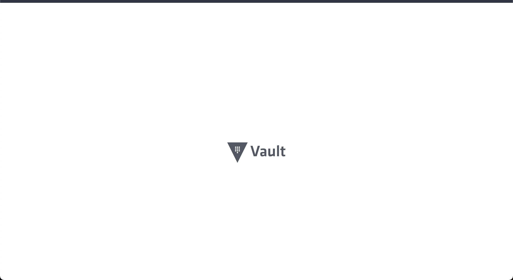
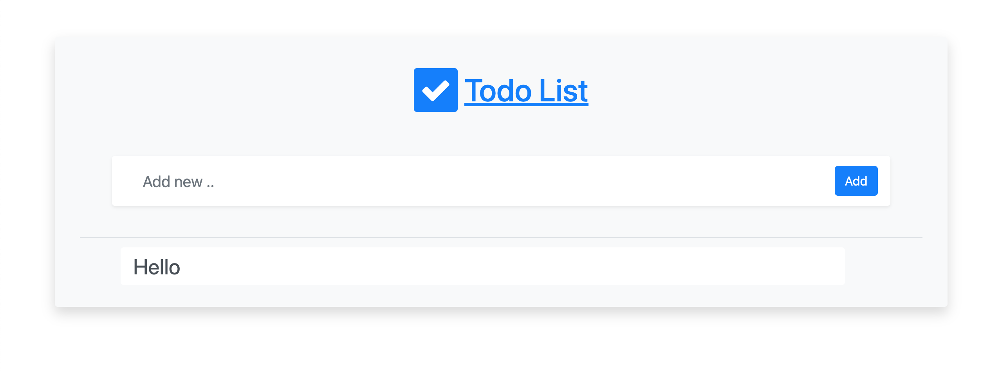

# Vault Demo

This repository contains the code for a basic Golang application that retrieves secrets from Hashicorp Vault

## How to run

- Clone this repository by running the command `git clone https://github.com/vault-demo`

- Install Hashicorp Vault in your Kubernetes cluster by following the instructions [here](https://learn.hashicorp.com/tutorials/vault/kubernetes-minikube?in=vault/kubernetes)

- Set 2 secrets in vault - `username` and `password`, with their respective values. This repository assumes you are using the default postgres username of `postgres` and a password of `admin`. If your configuration is different, make sure to update the `postgres_password` key in the secrets.yaml file found in the `manifests` folder.

- Update the `vault_token` key in the secrets.yaml file as well to the token you used when setting up vault.

> Note that all values in secrets.yaml are base64 encoded. Use the command `echo <value> | base64` to encode a value.

- Run the command `make` to apply all resources in your cluster and run `kubectl get pods` periodically untill all pods are in the running state.

- Finally, run the command `kubectl port-forward svc/vaultapp 3000:3000` and visit `http://localhost:3000` in your browser to see the application.

